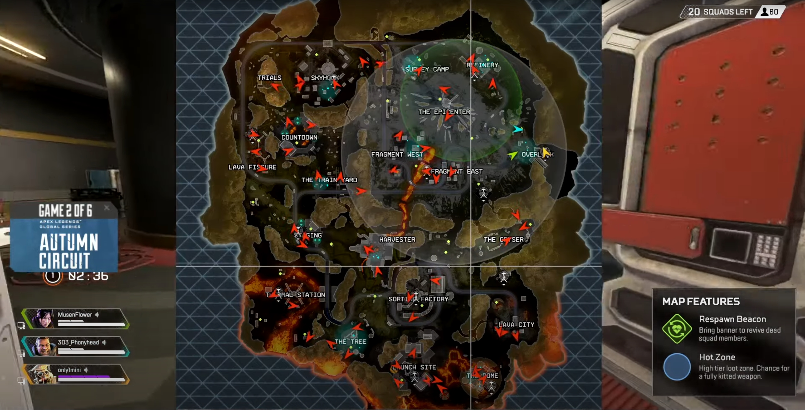
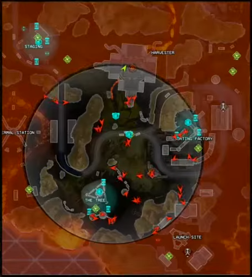
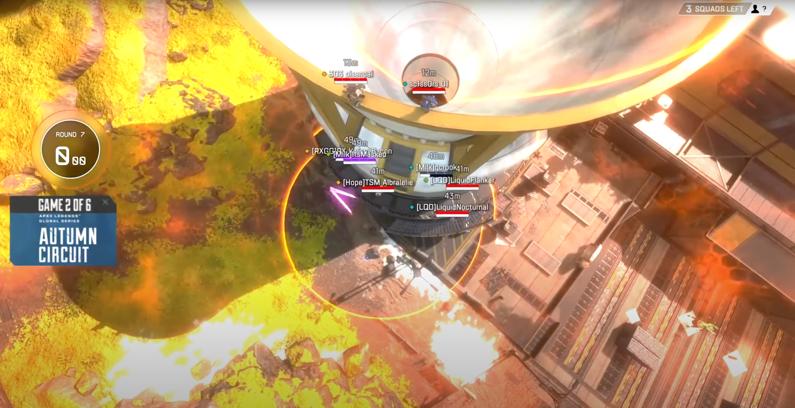
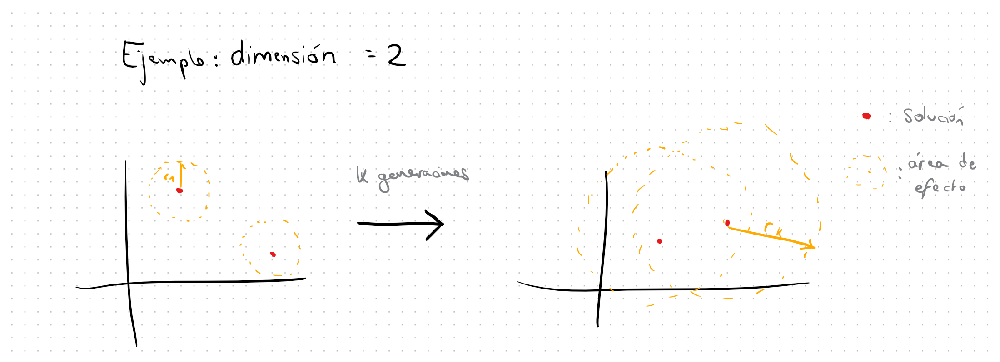

# Optimización de la búsqueda multiarranque básica usando las ideas de los juegos de tipo Battle Royale

> Autor: Andrés Millán
> Correo: amilmun@ugr.es

## Preámbulos

En los últimos años, se ha puesto de moda inspirarse en los procesos naturales para crear una metaheurística. Esta forma de trabajar ha sido criticada por el medio, pues no garantiza que se consigan algoritmos competentes ni mejore el estado del arte.

Ignorando esta crítica, nosotros intentaremos producir una nueva usando como base un tipo de población: la de humanos pasándoselo bien.

* * *

## Los juegos del género battle royale

En la era moderna de los juegos competitivos online, ha surgido un género denominado **battle royale**.

En ellos, varios jugadores o equipos son lanzados en un mapa, de forma que pueden recorrerlo libremente. Al ser un juego competitivo, deben luchar entre ellos, y quien quede en pie al final, ganará.
Los diseñadores emplean un método al que se le suele llamar **anillos** para darle emoción. Tras cierto tiempo, y dependiendo de la ronda, se reduce el terreno de juego mediante una zona de radio decreciente. Poco a poco, va atrapando a los equipos, de forma que se ven obligados a ir hacia el centro del mapa, lo que incrementa las probabilidades de que surjan enfrentamientos.

Para ejemplificar esto, usaremos el juego llamado **Apex Legends**.

Al principio de la batalla, los jugadores se encuentran repartidos por el mapa en zonas de interés (debido al equipamiento):


En las siguientes rondas, vemos que el anillo se cierra y propicia encuentros:




* * *

## Adaptándolo a una metaheurística

Este comportamiento resulta muy interesante. Podemos intentar extrapolar la idea de *anillo*, y aplicársela a un conjunto de soluciones de una metaheurística.

En primera instancia, mi idea inicial era dividir el espacio de búsqueda en sectores, de forma que se forzara a combatir a dos soluciones cuando se encontraban en el mismo. Sin embargo, esta idea resulta difícil de implementar, es costosa (pues escala muy mal con las dimensiones), y podría generar absurdos (dos soluciones muy cercanas que no combatan).

Por ello, simularemos los anillos a la inversa: de cada solución partirá un anillo, que irá creciendo conforme pasen las generaciones. Al principio, será una bola n-dimensional pequeña. Al tiempo, aumentará su radio, lo que hará que se encuentre con otras soluciones. Cuando esto ocurra, las haremos combatir. La peor de las dos morirá, y la otra seguirá avanzando.



Al final, quedará una única solución (o varias, y nos quedaremos con la mejor), que será la vencedora del algoritmo.

Con este planteamiento, es muy importante acertar con el esquema evolutivo de la población. Una mala elección de los parámetros puede hacer que esta metaheurística no tenga ningún sentido. Por ejemplo, una tasa baja de crecimiento de los anillos hará que no se combata nunca. O una búsqueda local muy exhaustiva agotará todas las evaluaciones de las que
disponemos.

* * *

## Implementación inicial

Una vez hemos planteado las ideas básicas del algoritmo, es hora de pasar a la implementación.

Para la búsqueda local, usaremos la proporcionada por Daniel Molina: la Solis-Wets. Además, debemos definir nuestra función de aumento de radio. Es importante encontrar un buen equilibrio entre el crecimiento del radio y el número de evaluaciones. Si aumentamos demasiado rápido el radio, la población morirá pronto. Si se limita su crecimiento, las soluciones nunca combatirán.
Como vamos a limitar la BL a 100 evaluaciones por ejecución, en esta primera versión usaremos `radio_antiguo + k`, con `k = 2.5`. De momento, esto funciona suficientemente bien. Se mantiene el equilibrio que buscábamos en mayor o menor medida. Más tarde investigaremos si merece la pena cambiarla.

El pseudocódigo sería similar al siguiente:

```
// ──────────────────────────────────────────────────────────────── VERSION 1 ─────
/*
    Se asume una estructura del tipo {
        solucion,
        fitness
    },
    que tiene implementados comparadores de igualdad y de orden
*/

incrementar_radio (radio_antiguo) {
    return radio_antiguo + k
}


MH_battle_royale () {
    // ─────────────────────────────────────────────────────────── PARAMETROS ─────

    dim = 10

    generador: Random con distribución uniforme en (-100, 100)
    semilla = ...

    poblacion_inicial = 20
    periodo_generacional = 3
    evaluaciones_maximas_bl = 100
    delta = 0.4
    radio = 0.1

    poblacion = generar_poblacion_inicial(poblacion_inicial, dim, generador)
    evaluaciones = poblacion_inicial

    // ────────────────────────────────────────────────────── BUCLE PRINCIPAL ─────

    t = 1

    while (evaluaciones < 10000 * dim) {
        if (t % periodo_generacional == 0) {
            Comprobar si en `poblacion` existen dos o más elementos con distancia entre ellos menor que radio.
            Si es así, eliminar la(s) que tenga(n) peor fitness.
        }

        radio = incrementar_radio(radio)

        // Aplicar BL a las soluciones
        for (i in 0..poblacion.size()) {
            evaluaciones += bl_soliswets(
                poblacion[i].solucion,
                poblacion[i].fitness,
                delta,
                evaluaciones_bl_maxiams,
                -100,
                100,
                generador
            )

            poblacion[i].fitness = fitness(poblacion[i].solucion)
            evaluaciones++
        }

        t++
    }

    poblacion.sort()

    return poblacion[0]     // Contiene solución y fitness.
}
```


* * *


## Primeros resultados

La primera versión es muy sencilla, y se trata de un optimizador de búsqueda multiarranque básica. No debemos esperar grandes resultados. Para simplificar, únicamente miraremos los resultados al 5, 20, 50 y 100% en estas primeras versiones. Además, evitaré poner toda la información en esta memoria para simplificar. Los archivos con toda la información se encontrarán en el repositorio.

Usando la suite de Tacolab, obtenemos los siguientes resultados:

### Dimensión 10

| Porcentaje | DE | PSO | mh-battle-royale |
|------------|----|-----|------------------|
| 5%         | 7  | 10  | 13               |
| 20%        | 20 | 6   | 4                |
| 50%        | 21 | 7   | 2                |
| 100%       | 19 | 8   | 4                |

### Dimensión 30

| Porcentaje | DE | PSO | mh-battle-royale |
|------------|----|-----|------------------|
| 5%         | 8  | 3   | 19               |
| 20%        | 17 | 2   | 11               |
| 50%        | 23 | 2   | 5                |
| 100%       | 22 | 3   | 5                |


### Conclusiones versión 1

De momento, los resultados no son muy prometedores. Claramente el algoritmo no rinde bien, y se queda atascado. Aunque al inicio se consigan mejores resultados, conforme aumenta el número de evaluaciones, las soluciones no mejoran. Debemos hacer algo para arreglar esto.


* * *


## La necesidad de optimizar

> A partir de ahora, se documentará únicamente las mejoras que se realicen. Cuando lleguemos al final, recopilaremos todos los datos, mostrando los resultados cumulativos de estas optimizaciones.

Algunos de los motivos por los que pueda estar fallando nuestro algoritmo es por la falta de diversificación. Aunque partimos de varias soluciones, muchas veces nos quedamos atrancados en óptimos locales. Además, un crecimiento del radio lineal no asegura que al final quede una única solución. Por último, podríamos intentar partir de mejores soluciones, para que la búsqueda proporcione resultados más prometedores.

### Versión 2: sondeando el terreno

Desarrollemos la idea del último punto. Para no empezar en situaciones que no nos garantizan nada, modificaremos la generación de soluciones inicial para quedarnos con las mejores. Eso debería reducir el número de evaluaciones necesarias hasta llegar a un mínimo local.

```
──────────────────────────────────────────────────────────────── VERSION 2 ─────

generar_poblacion_inicial(elementos_poblacion, aleatorios_a_generar, dim) {
    for (_ in 0 .. aleatorios_a_generar) {
        poblacion.push(
            generar_nueva_solucion(dim)
        )
    }

    poblacion.sort()
    poblacion.erase(poblacion.begin() + elementos_poblacion, poblacion.end())

    return poblacion
}


MH_battle_royale () {
    // ─────────────────────────────────────────────────────────── PARAMETROS ─────

    ...

    poblacion_inicial = 20
    const int aleatorios_a_generar = 100;

    poblacion = generar_poblacion_inicial(poblacion_inicial, aleatorios_a_generar, dim, generador)
    evaluaciones = aleatorios_a_generar

    ...

    // ────────────────────────────────────────────────────── BUCLE PRINCIPAL ─────
    ...
```

### Versión 3: añadiendo variedad

Uno de los problemas con los que nos encontramos es que, aunque consigamos una solución medianamente aceptable, rápidamente nos quedamos estancados. Para solucionarlo, haremos lo siguiente: cuando quede únicamente un elemento en la generación, crearemos otras nuevas partiendo de la ganadora. Utilizaremos un operador de mutación fuerte similar al visto en las prácticas para el ILS del PAR:

```
mutar (original) {
    s = original.clone()

    inicio_segmento = aleatorio en [0, s.size())
    tamano_segmento = aleatorio en (-100, 100)

    i = inicio_segmento
    copias = 0

    while (copias < tamano_segmento) {
        s[i] = original[i]

        i = (i+1) % s.size()

        copias++
    }

    while (true) {
        s[i] = aleatorio en (-100, 100)

        i = (i+1) % s.size()

        if (i == inicio_segmento) {
            break
        }
    }

    return s
}
```

De esta forma, añadimos algo de variedad. Mientras tanto, se seguirá ejecutando la BL para cada elemento de la población.

Para complementar esta nueva forma de proseguir en las fases tardías, cambiaremos el esquema de aumento del radio al siguiente:

```
incrementar_radio (radio_antiguo) {
    return radio_antiguo * 1.1 + k  // k = 1 en esta versión
}
```

Lo que conseguimos con esto es que, durante las primeras generaciones, el radio crece lo suficientemente lento como para que la búsqueda local sea efectiva, y se converja a unas soluciones aceptables. Cuando el radio sea considerablemente grande, empezarán a luchar. Finalmente, cuando solo quede una, se irá repoblando, haciendo que luche contra hijos de la mejor.

Para hacer más justa la última fase, reduciremos el radio para que les dé tiempo a las mutaciones a desarrollarse. Actualmente, se ha implementado como `radio = radio/5`. Produce un buen equilibrio entre desarrollo y malgasto de evaluaciones del fitness.

Además, vamos a aumentar el número de elementos iniciales a `25` en vez de `20`, pues parece que tenemos margen en lo que respecta a las evaluaciones.


* * *


## Resultados finales

Finalmente, analizaremos los resultados obtenidos tras todas estas mejoras. Esta vez, estudiaremos con más detalle los resultados arrojados por Tacolab. Los ficheros generados con `extract.py` se encuentran en los archivos correspondientes a la [dimensión 10](./code/results_MH_battle_royale/results_cec2017_10.xlsx) y a la [dimensión 30](./code/results_MH_battle_royale/results_cec2017_30.xlsx).

### Dimensión 10

| **Evaluaciones** | **DE** | **MH Battle Royale** | **PSO** |
|:-----------------|-------:|---------------------:|--------:|
| 1%               |      3 |                   20 |       7 |
| 2%               |      4 |                   16 |      10 |
| 3%               |      4 |                   17 |       9 |
| 5%               |      8 |                   14 |       8 |
| 10%              |     19 |                    5 |       6 |
| 20%              |     22 |                    2 |       6 |
| 30%              |     21 |                    3 |       6 |
| 40%              |     22 |                    2 |       6 |
| 50%              |     21 |                    2 |       7 |
| 60%              |     19 |                    3 |       8 |
| 70%              |     17 |                    5 |       8 |
| 80%              |     17 |                    5 |       8 |
| 90%              |     17 |                    7 |       7 |
| 100%             |     17 |                    9 |       5 |


De nuevo, podemos observar que al principio del algoritmo se consiguen muy buenos resultados. Esto es debido al esquema de generación de vecinos. No obstante, a partir del 10% de evaluaciones, se pierde la ventaja que se había obtenido. Esto es debido a la fase de mejora de soluciones en la búsqueda local, que "desperdicia" varias evaluaciones con el objetivo de encontrar una solución decente. En el tramo final, se recupera cierta ventaja (especialmente ante PSO) debido a la nueva progresión que hemos implementado

No obstante, se necesita mejorar el rendimiento claramente, pues la mayor parte de las veces rinde mejor Differential Evolution.

### Dimensión 30

| **Evaluaciones** | **DE** | **MH Battle Royale** | **PSO** |
|:-----------------|-------:|---------------------:|--------:|
| 1%               |      3 |                   16 |      11 |
| 2%               |      2 |                   17 |      11 |
| 3%               |      2 |                   19 |       9 |
| 5%               |     10 |                   15 |       5 |
| 10%              |     16 |                   11 |       3 |
| 20%              |     19 |                    8 |       3 |
| 30%              |     20 |                    8 |       2 |
| 40%              |     20 |                    8 |       2 |
| 50%              |     21 |                    8 |       1 |
| 60%              |     23 |                    6 |       1 |
| 70%              |     22 |                    7 |       1 |
| 80%              |     20 |                    9 |       1 |
| 90%              |     22 |                    7 |       1 |
| 100%             |     21 |                    8 |       1 |

En la dimensión 30, se observa un resultado parecido al anterior. Sin embargo, ahora en las últimas fases no se mejora tanto. Podemos ver cómo a partir del 20% de evaluaciones no se mejora lo suficiente como para superar a Differential Evolution.

Debemos destacar positivamente la mejora que hay con respecto a la primera implementación. De ser la mejor en 3 de las 30 funciones, ha pasado a ganar en 8 de las 30. No obstante, sigue siendo un resultado algo mediocre.

### Conclusiones

Lo primero que debemos destacar es que **nuestro algoritmo no es bueno**. Es normal, pues batir a dos de los algoritmos más famosos, con años de robustez demostrada, es complicado. No obstante, esto no debe manchar el propósito de esta práctica, que es mostrar cómo se diseña una metaheurística.

Durante el desarrollo de ésta, hemos mostrado la inspiración detrás del algoritmo. Hemos abstraído los elementos más importantes del juego, propuesto una implementación, y analizado sus resultados iniciales.
Tras esto, nos hemos dado cuenta de que necesitamos mejorarla. Para ello, hemos pensado en el comportamiento de ésta, y hemos realizado una mejora en los vecinos. Para afinar el crecimiento, y siguiendo el modelo de enfriamiento simulado, hemos implementado un esquema distinto de crecimiento del radio. Finalmente, hemos tomado una mutación de los algoritmos genéticos para añadir diversificación+explotación en las últimas fases.

Quizás el esquema de diversificación y explotación sea el inverso, y eso es lo que está generando los problemas de las últimas generaciones. Sería necesario un análisis más exhaustivo para demostrarlo.

#### Posibles mejoras
Intentemos razonar sobre cuáles son las áreas en las que podamos mejorar nuestro algoritmo.

Uno de los principales problemas que tenemos es el gasto que producen las primeras fases. Se intenta ver cuál es la mejor parte del terreno, por lo que partimos de soluciones mediocres, y poco a poco las mejoramos hasta que se vuelven decentes. Hacer una búsqueda local es caro, y deberíamos intentar aplicarla las mínimas veces posibles. Y, si lo hacemos, que consigamos una disminución del fitness considerable. Es por ello que debemos ajustar lo más finamente posible nuestra búsqueda local. Podríamos intentar analizar cuáles son las soluciones que mayor disminución del fitness consiguen en una sola BL, de forma que se prioricen en la exploración.

Otra de las formas las que te puede seguir mejorando el algoritmo es mediante un cambio en el esquema de aumento del radio. Podríamos intentar hacerlo dinámico, de forma que el radio aumente más conforme menos evaluaciones resten. De esta forma, se vuelve más agresivo.

En lo que respecta a la última parte del algoritmo, claramente concluimos que nos quedamos estancados en óptimos locales, y no podamos salir de ellos. Este es el mismo problema que habíamos intentado arreglar antes. Sin embargo, aún con la mutación realizada, no ha sido posible solucionarlo de forma satisfactoria. Es posible que se deba a que una única solución no proporciona suficiente diversidad. Podríamos intentar cruzar varias soluciones distintas. No obstante, esto haría que nuestro algoritmo se parecía mucho a un memético, por lo que perdería interés el ejercicio.

Parece evidente por tanto, que la inspiración natural hace que converjamos en clases de algoritmos similares. Siguiendo estas ideas, llegaríamos a un memético como hemos comentado, aún siendo la idea original bastante diferente. ¿Quizás estemos usando metaconocimiento del medio? Volver a nuestro análisis inicial podría darnos más ideas sobre cómo mejorar la metaheurística battle royale..

Es importante mencionar también que hemos hecho la comparación con dos algoritmos de los más débiles DE y PSO. Si usáramos alguno de los más modernos, claramente nuestro algoritmo no tendría nada que hacer. Esto demuestra cuánto avanzado el área, aún habiéndose estancado en los últimos años.